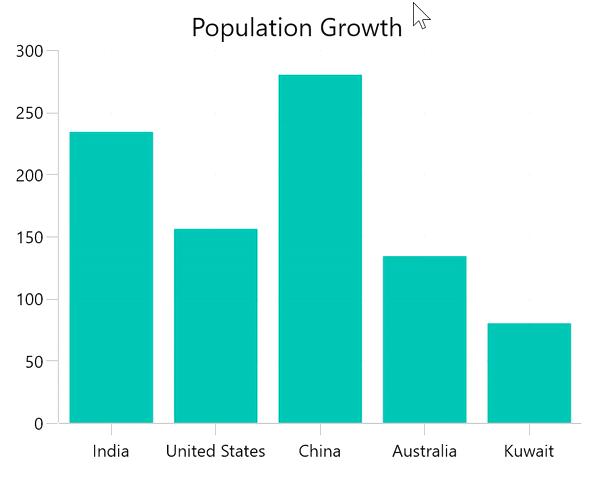

# How to display more data in the tooltip in WinUI charts(SfCartesianChart)

[WinUI Chart](https://www.syncfusion.com/winui-controls/charts) provides the support to display the needed information from its model of populated items source along with the Tooltip UI customization with the help of the [TooltipTemplate](https://help.syncfusion.com/cr/winui/Syncfusion.UI.Xaml.Charts.ChartSeriesBase.html#Syncfusion_UI_Xaml_Charts_ChartSeriesBase_TooltipTemplate) in the chart series as shown in the following code example. 

Here, display both country's name and population details in the tooltip. By default, it shows the corresponding y-axis value of that segment.

```
<chart:SfCartesianChart Header="Population Growth">
    <chart:SfCartesianChart.DataContext>
        <local:ViewModel/>
    </chart:SfCartesianChart.DataContext>

    <chart:SfCartesianChart.Resources>
        <ResourceDictionary>
            <DataTemplate x:Key="tooltipTemplate">
                <StackPanel Orientation="Horizontal">
                    <!--Template element has DataContext as its Segment named Item. From it, access the corresponding Model-->
                    <TextBlock  FontFamily="Segoe UI" Foreground="White">
                       <Run Text="{Binding Item.Country}"/>
                       <Run Text=":"/>  
                       <Run Text="{Binding Item.Population}"/>
                    </TextBlock>
                </StackPanel>
            </DataTemplate>
        </ResourceDictionary>
    </chart:SfCartesianChart.Resources>

    <chart:SfCartesianChart.XAxes>
        <chart:CategoryAxis/>
    </chart:SfCartesianChart.XAxes>
    <chart:SfCartesianChart.YAxes>
        <chart:NumericalAxis/>
    </chart:SfCartesianChart.YAxes>

    <chart:ColumnSeries ItemsSource="{Binding Data}"
                        XBindingPath="Country" YBindingPath="Population"
                        ShowTooltip="True"
                        TooltipTemplate="{StaticResource tooltipTemplate}">
    </chart:ColumnSeries>
</chart:SfCartesianChart>
```

## Output:



KB article - [How to display more data in the tooltip in WinUI charts?]()

## See also

[How to customize the tooltip background style?](https://help.syncfusion.com/winui/cartesian-charts/tooltip#background-style)
